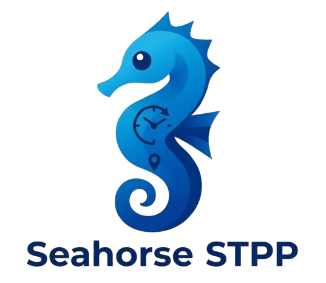

<div align="center">



**A modular, research-grade framework for end-to-end development, training, and evaluation of**
**Spatio-Temporal Point-Process (STPP) models.**
Seahorse couples declarative YAML configuration with PyTorch Lightning execution,
Ray Tune hyper-parameter optimisation, and version-controlled logging to deliver
rapid prototyping and rigorous, reproducible benchmarking on streaming event data.

Documentation: https://yahyaaalaila.github.io/seahorse/

[](https://github.com/YahyaAalaila/seahorse/commits)
[](https://github.com/YahyaAalaila/seahorse)
[](https://github.com/YahyaAalaila/seahorse/issues)
[](LICENSE)

[](https://www.python.org/)
[](https://pytorch.org/)
[](https://lightning.ai/)
[](https://docs.ray.io/en/latest/tune/)

</div>

---

| [News](#news) | [What you can build with Seahorse STPP](#what-you-can-build-with-seahorse-stpp) | [Features](#features) | [Quick Start](#quick-start) | [Supported models](#supported-models) | [Datasets](#datasets) | [CLI](#cli) | [Citation](#citation) | [License](#license) | [Acknowledgment](#acknowledgment) |

---

## 🗞️ News [[Back&nbsp;to&nbsp;Top](#top)]

- &nbsp; Documentation: https://yahyaaalaila.github.io/seahorse/
- &nbsp; Seahorse includes executable Colab tutorials for single-model training and benchmark campaigns.
- &nbsp; The documentation includes an end-to-end case study that walks from JSONL data to benchmark artifacts.
- &nbsp; [24-05-2025] Presentation at [Machine Learning &amp; Global Health Network (MLGH)](https://mlgh.net/), London, UK.
- &nbsp; [01-04-2025] Our [knowledgebase website](https://events2025.github.io/) is finally up.
- &nbsp; [13-02-2025] Our review paper about [Neural Spatiotemporal Point Processes: Trends and Challenges](https://arxiv.org/abs/2502.09341) is up on [arxiv](https://arxiv.org/abs/2502.09341).

---

## 💡 What you can build with Seahorse STPP [[Back&nbsp;to&nbsp;Top](#top)]

Seahorse provides a flexible framework to model complex event dynamics. You can build applications for:

- **Epidemiology:** Modeling the spread of infectious diseases over time and regions.
- **Seismology:** Forecasting earthquake occurrences and aftershock propagation.
- **Urban Mobility:** Analyzing and predicting bike-sharing demand and traffic flows.
- **Social Networks:** Tracking information diffusion and viral content over time.
- **Finance:** Modeling high-frequency trading events and market shocks.

---

## ✨ Features [[Back&nbsp;to&nbsp;Top](#top)]

- **Unified Python API**: Train, evaluate, and sample any model through one consistent interface (`STPPRunner`).
- **YAML-driven config**: Every hyperparameter is declarative; experiments are fully reproducible.
- **Plug-and-play presets**: Switch models with `--preset auto_stpp` — no code changes required.
- **Ray Tune HPO**: YAML search-space files feed directly into distributed hyperparameter sweeps.
- **Benchmark campaigns**: Multi-preset × multi-dataset × multi-seed runs with a single CLI command.
- **Data contract**: `Benchmark` enforces identical train/val/test splits across all presets so NLL scores are directly comparable.
- **HuggingFace datasets**: Stream or cache any JSONL dataset directly from the Hub with `--dataset owner/repo`.

---

## 🚀 Quick Start [[Back&nbsp;to&nbsp;Top](#top)]

For more detailed guides, check out our documentation:

- [Getting Started](https://yahyaaalaila.github.io/seahorse/getting-started/)
- [Why Seahorse?](https://yahyaaalaila.github.io/seahorse/why-seahorse/)
- [End-to-End Case Study](https://yahyaaalaila.github.io/seahorse/examples/case-study/)
- [Predicting with Models](https://yahyaaalaila.github.io/seahorse/run-models/predict/)

**Install**

*macOS / Linux:*

```bash
python -m venv .venv && source .venv/bin/activate
pip install -e .
```

*Windows:*

```powershell
python -m venv .venv
.\.venv\Scripts\activate
pip install -e .
```

**Python API**

```python
from seahorse import AutoSTPP, PoissonGMM, load_jsonl

train = load_jsonl("dataset_root/train.jsonl")
val   = load_jsonl("dataset_root/val.jsonl")
test  = load_jsonl("dataset_root/test.jsonl")

model    = AutoSTPP(device="cpu")
baseline = PoissonGMM()

model.fit(train, val, test, epochs=50, batch_size=64)
scores  = model.evaluate(test)          # {"test_nll": ..., "mean_seq_nll": ...}
samples = model.predict_next(test, n_samples=32)
```

**STPPRunner (lower-level)**

```python
from seahorse import STPPRunner

runner = STPPRunner.from_preset("auto_stpp")
result = runner.fit(train, val, test)   # returns RunResult
runner.save("/tmp/my_run/")

runner2 = STPPRunner.load("/tmp/my_run/")
grid    = runner2.intensity_grid(test[0])
```

---

## 🤖 Supported models [[Back&nbsp;to&nbsp;Top](#top)]

Our package includes the following state-of-the-art STPP models:

| No | Venue      | Preset                                  | Paper                                                                                            | Implementation |
| :-: | ---------- | --------------------------------------- | ------------------------------------------------------------------------------------------------ | :------------: |
| 1 | NeurIPS'23 | `auto_stpp`                           | [Automatic Integration for Spatiotemporal Neural Point Processes](https://arxiv.org/abs/2310.01179) |    PyTorch    |
| 2 | L4DC'22    | `deep_stpp`                           | [Deep Spatiotemporal Point Process](https://proceedings.mlr.press/v168/lin22a.html)                 |    PyTorch    |
| 3 | ICLR'21    | `neural_jumpcnf` / `neural_attncnf` | [Neural Spatio-Temporal Point Processes](https://openreview.net/forum?id=XQQA6-So14)                |    PyTorch    |
| 4 | NeurIPS'19 | `njsde`                               | [Neural Jump Stochastic Differential Equations](https://arxiv.org/abs/1905.10403)                   |    PyTorch    |
| 5 | ACM KDD'23 | `diffusion_stpp`                      | [Spatio-temporal Diffusion Point Processes](https://dl.acm.org/doi/10.1145/3580305.3599511)         |    PyTorch    |
| 6 | ICLR'22    | `nsmpp`                               | [Neural Spectral Marked Point Processes](https://openreview.net/forum?id=0rcbOaoBXbg)               |    PyTorch    |
| 7 | Arxiv      | `smash`                               | [Embedding Event History to Vector](https://arxiv.org/abs/2310.19324)                               |    PyTorch    |
| 8 | ICML'20    | `thp_gmm`                             | [Transformer Hawkes Process](https://arxiv.org/abs/2002.09291)                                      |    PyTorch    |
| 9 | KDD'16     | `rmtpp_gmm`                           | [Recurrent Marked Temporal Point Processes](https://dl.acm.org/doi/10.1145/2939672.2939875)         |    PyTorch    |

**Parametric baselines** (fast, exact likelihood):
`poisson_gmm` · `hawkes_gmm` · `selfcorrecting_gmm` · `poisson_cnf` · `hawkes_cnf` · `selfcorrecting_cnf` · `poisson_tvcnf` · `hawkes_tvcnf` · `selfcorrecting_tvcnf`

---

## 📊 Datasets [[Back&nbsp;to&nbsp;Top](#top)]

Seahorse reads any collection of JSONL event sequences. The canonical split layout is:

```text
dataset_root/
  train.jsonl
  val.jsonl
  test.jsonl
```

Each line is one sequence:

```json
{"times": [0.1, 0.4, 1.2], "locations": [[0.2, 0.4], [0.3, 0.8], [0.7, 0.1]]}
```

Datasets from the original NeuralSTPP paper are directly supported:

- **Pinwheel** — Synthetic multimodal non-Gaussian process. 10 clusters in a pinwheel structure; events propagate clock-wise via a multivariate Hawkes mechanism. Tests the ability to capture drastic history-driven spatial shifts.
- **Earthquake** — Real-world seismic event catalog ([U.S. Geological Survey, 2020](https://earthquake.usgs.gov/)).
- **COVID-19** — Geo-located case reports ([New York Times, 2020](https://github.com/nytimes/covid-19-data)).
- **Citibike** — NYC bike-share ride starts; useful for dense urban mobility modelling.

Datasets can also be streamed from [HuggingFace Hub](https://huggingface.co/datasets) via `--dataset owner/repo`.

For a complete catalog of available datasets, please visit the [Datasets Documentation](https://yahyaaalaila.github.io/seahorse/datasets/catalog/).

---

## 💻 CLI [[Back&nbsp;to&nbsp;Top](#top)]

**Fit one model**

```bash
python -m seahorse fit \
  --preset auto_stpp \
  --train dataset_root/train.jsonl \
  --val   dataset_root/val.jsonl \
  --test  dataset_root/test.jsonl \
  --out   runs/quickstart
```

**Benchmark campaign** (multi-preset × multi-seed)

```bash
python -m seahorse bench \
  --presets auto_stpp deep_stpp njsde poisson_gmm \
  --splits_dir splits/ \
  --seeds 1 2 3 \
  --out runs/bench \
  --n_workers 4
```

**HPO sweep**

```bash
python -m seahorse tune \
  --preset auto_stpp \
  --search_space configs/hpo/auto_stpp_search.yaml \
  --train dataset_root/train.jsonl \
  --val   dataset_root/val.jsonl \
  --n_trials 30
```

---

## 📝 Citation [[Back&nbsp;to&nbsp;Top](#top)]

If Seahorse supports your work, please cite it. The accompanying paper is in
preparation; until the preprint is public, cite the software release:

```bibtex
@software{seahorse2026,
  title   = {Seahorse: Unified Benchmarking for Spatio-Temporal Point Processes},
  author  = {Aalaila, Yahya and Gro{\ss}mann, Gerrit and Vollmer, Sebastian},
  year    = {2026},
  version = {0.1.0},
  url     = {https://github.com/YahyaAalaila/seahorse},
  license = {Apache-2.0}
}
```

GitHub's **Cite this repository** button (from [`CITATION.cff`](CITATION.cff)) offers the same entry in APA and BibTeX.

---

## ⚖️ License [[Back&nbsp;to&nbsp;Top](#top)]

Seahorse is distributed under the **Apache License 2.0**. See [LICENSE](LICENSE) and [NOTICE](NOTICE).

---

## 🙏 Acknowledgment [[Back&nbsp;to&nbsp;Top](#top)]

**Funding.** The authors received support from the Bundesministerium für Bildung und Forschung (BMBF) under Grant No. 01W23005 for the project EVENTFUL.

**Contributors.** Beyond the authors, we thank Ismail Drief and Raphael Sonabend-Friend for their contributions to the codebase and its early design.

**Upstream implementations.** Seahorse builds on the original implementations of the paper families it wraps. We thank the authors of AutoSTPP, DeepSTPP, NeuralSTPP, NJSDE, DiffusionSTPP, NSMPP, SMASH, THP, and RMTPP for releasing their code.
