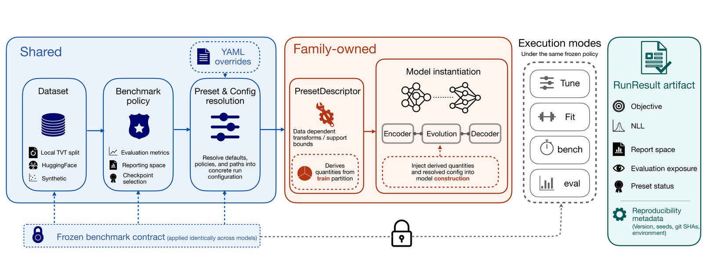

# Architecture

Seahorse enforces a **benchmark contract** that separates what the framework controls from what each model family controls. This page explains that separation so you know where to look when adding a model, debugging a run, or interpreting results.



*Figure 3 from the Seahorse paper: the execution contract. Shared components are framework-owned (left). Family-owned components control data-dependent transforms and model construction (centre). All four execution modes write a `RunResult` artifact (right).*

---

## Shared Layer

The shared layer runs **identically** for every model family. It fixes the benchmark before any model-specific code executes.

| Component | Module | Responsibility |
| --- | --- | --- |
| **Dataset** | `training/data_module.py` | Load local or Hugging Face JSONL splits; apply `protocol` and `normalize` settings |
| **Benchmark policy** | `benchmark/benchmark.py` | Force `protocol="unified"` and a single `normalize` value across all presets; prevent re-splitting or per-model coordinate changes |
| **Config resolution** | `config/schema.py` | Merge YAML defaults → preset defaults → CLI `--override` into a `STPPConfig` (validated Pydantic v2) |
| **Training harness** | `training/lightning_module.py` | Per-event NLL aggregation, checkpointing, early stopping — same for all families |

`STPPConfig` has four sub-configs: `DataConfig`, `ModelConfig`, `TrainingConfig`, `LoggingConfig`. The resolved config is serialised with the run and is the source of truth for what was actually trained.

!!! note "Why the shared layer matters for comparisons"
    Benchmark NLL values are only directly comparable when all presets are evaluated under the same dataset, normalization, and metric definition. The shared layer enforces this — no preset can silently change the coordinate system or re-split the data during a benchmark run.

---

## Family-Owned Layer

Each model family registers a `ModelFamilyConfig` subclass and an optional `PresetDescriptor`. This is where family-specific behaviour lives.

### Preset registry

```python
# config/schema.py — how presets are resolved
PRESET_SPECS  = { preset_name: {"family": ..., "defaults": {...}} }
FAMILY_CONFIGS = { family_name: ModelFamilyConfig subclass }
```

`build_model(config, preset, ...)` merges resolved defaults, looks up the family config class, calls `from_dict()`, then calls `build_model()` on the resulting config object. No assembly logic lives in the registry itself.

### PresetDescriptor

`presets/auto_stpp.py`, `presets/neural_stpp.py`, etc. each define a `PresetDescriptor` that the runner calls **before** `build_model()`:

- `descriptor.data_init_overrides(dm)` — computes training-data-dependent quantities (e.g., bounding box for `auto_stpp`, float64 / MPS fallback for Neural STPP ODE solver).
- Results are merged into `build_overrides` and passed to `ModelFamilyConfig.from_dict()`.

This is the only point where training-data statistics can enter model construction — they are computed from the training partition only and are never derived from validation or test data.

### ModelFamilyConfig pattern

Each family config is a dataclass with two required methods:

```python
@dataclass
class MyFamilyConfig(BaseModelConfig):
    @classmethod
    def from_dict(cls, merged_dict, *, hidden_dim, spatial_dim, ...) -> "MyFamilyConfig":
        ...  # instantiate from already-merged dict

    def build_model(self) -> UnifiedSTPP:
        ...  # return fully wired model, no arguments
```

Existing families: `DeepSTPPConfig`, `AutoSTPPConfig`, `NeuralSTPPConfig`, `SMASHConfig`.

---

## Model Layer

Every model is a `UnifiedSTPP(state_model, event_model, *, hidden_dim)`. The three-component decomposition from the paper maps directly to the code:

```
Event history → StateModel.encode() → StateModel.evolve() → EventModel.log_prob() → NLL
```

| Paper component | Code role | Examples |
| --- | --- | --- |
| **History encoder** | `StateModel` owns `self.encoder` | `TransformerEncoder`, `TransformerST` |
| **State evolution** | `StateModel.evolve()` — piecewise-constant or ODE | `JumpOdeIntensityProcess` (neural ODE + Euler solver) |
| **Decoder / event law** | `EventModel` owns spatial and temporal decoders | `MonotoneIntegralDecoder`, `HawkesGaussianDecoder`, `JumpCNFSpatial` |

The `EventModel.log_prob()` return value determines both the training objective **and** the available evaluation queries. Families that return an exact point-process log-likelihood support NLL metrics; families that return a surrogate (score-matching, ELBO) do not.

!!! warning "Exact vs approximate NLL"
    `SMASH` and `DiffusionSTPP` optimise surrogate objectives. Their `test_nll` values are not directly comparable to exact-NLL families. The [Model Capability Matrix](model-capability-matrix.md) flags this.

---

## Execution Modes

All four modes go through the same shared layer, then differ in what they do with the model and outputs.

| Mode | Entry point | What it does |
| --- | --- | --- |
| `fit` | `runner/runner.py` → `STPPRunner.fit()` | Train one config, checkpoint, write `RunResult` |
| `tune` | `benchmark/hpo.py` | Wrap `fit` in a Ray Tune loop; write `{preset}_best.yaml` |
| `bench` | `benchmark/benchmark.py` → `Benchmark.run()` | Grid over presets × datasets × seeds; apply benchmark policy; collect `RunResult` objects |
| `evaluate` | `__main__.py` `evaluate` subcommand | Load a saved run directory; compute metric profiles and visual artifacts |

`bench` calls `_apply_data_contract()` in both `tune_all()` and `run()`, which forces `protocol="unified"` and a single `normalize` setting on every config. This runs before any preset-specific code, so no preset can silently change the benchmark policy.

---

## Artifact Layer

Every `fit`, `tune`, and `bench` cell writes a `RunResult` artifact under the output directory.

```python
@dataclass
class RunResult:
    val_nll: float          # per-event NLL in training coordinate space
    test_nll: float
    norm_stats: dict        # {normalize, time_mean, time_std, loc_mean, loc_std}
    config: STPPConfig      # resolved config used for this run
    ...
```

| Artifact | Location | Contents |
| --- | --- | --- |
| `run_result.json` | run dir | `RunResult` fields including norm stats |
| `config.yaml` | run dir | Resolved `STPPConfig` (what was actually trained) |
| `checkpoint.ckpt` | run dir | PyTorch Lightning checkpoint |
| `metrics.json` | evaluate output | Per-metric results, availability, and reason if unavailable |
| `bench_meta.json` | bench dir | Benchmark configuration and provenance |
| `cell_index.json` | bench dir | Maps (preset, dataset, seed) to run directories |

`norm_stats` is required to convert normalised NLL back to original-coordinate NLL:

```
NLL_original = NLL_normalised − log(time_std × loc_std_x × loc_std_y)
```

---

## Quick Reference: Where to Look

| Question | Where to look |
| --- | --- |
| Why did my run use different normalization than expected? | `run_result.json` → `norm_stats`; check `DataConfig.normalize` |
| How do I add a new model? | [Adding A Model](adding-a-model.md) — start with `ModelFamilyConfig` |
| Why is my model's NLL not comparable to `auto_stpp`? | Check `EventModel.log_prob()` — is it exact or surrogate? |
| Why does `bench` override my preset's normalize setting? | `Benchmark._apply_data_contract()` — this is intentional |
| Where is the resolved YAML for a run? | `{run_dir}/config.yaml` |
