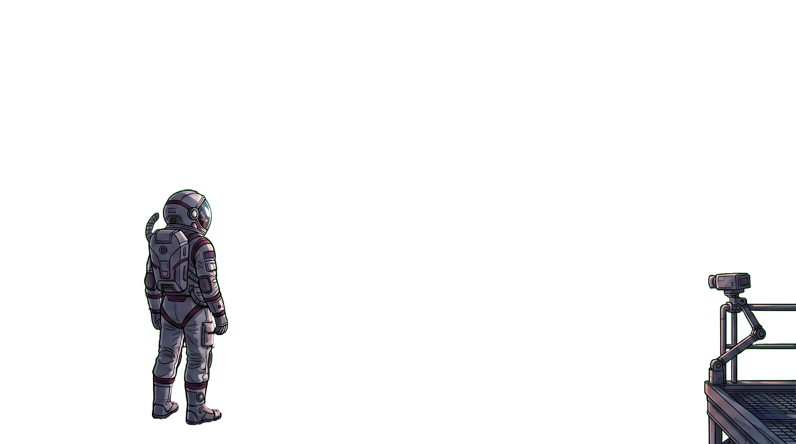

---
hide:
  - navigation
  - toc
---

  
  

    <h1 class="hero-title">STPP Easier than before</h1>
    
Discover the ultimate framework for modeling Spatial-Temporal Point Processes. Seahorse STPP simplifies complex data workflows, enabling you to build, train, and deploy models effortlessly.

    

      <a href="overview/" class="md-button md-button--primary">Getting Started</a>
      <a href="architecture/" class="md-button hero-btn-secondary">Learn More</a>
    

  

<h2 class="features-title">Everything you would expect</h2>

:fontawesome-brands-python:

<h3>Unified Python API</h3>

Train, evaluate, and sample any model through one consistent interface (STPPRunner).

:fontawesome-solid-file-code:

<h3>YAML-driven config</h3>

Every hyperparameter is declarative; experiments are fully reproducible.

:fontawesome-solid-plug:

<h3>Plug-and-play presets</h3>

Switch models with <code>--preset auto_stpp</code> — no code changes required.

:fontawesome-solid-network-wired:

<h3>Ray Tune HPO</h3>

YAML search-space files feed directly into distributed hyperparameter sweeps.

:fontawesome-solid-chart-line:

<h3>Benchmark campaigns</h3>

Multi-preset × multi-dataset × multi-seed runs with a single CLI command.

:fontawesome-solid-handshake:

<h3>Data contract</h3>

Benchmark enforces identical train/val/test splits across all presets so NLL scores are directly comparable.

:fontawesome-solid-database:

<h3>HuggingFace datasets</h3>

Stream or cache any JSONL dataset directly from the Hub with <code>--dataset owner/repo</code>.

<h2 class="models-title">Supported Models</h2>

Our package includes the following state-of-the-art STPP models.

<button class="slider-btn slider-btn-left" aria-label="Previous" onclick="document.getElementById('modelsSlider').scrollBy({left: -340, behavior: 'smooth'})">
  <svg xmlns="http://www.w3.org/2000/svg" viewBox="0 0 24 24"><path d="M15.41 16.59 10.83 12l4.58-4.59L14 6l-6 6 6 6 1.41-1.41z"/></svg>
</button>

:fontawesome-solid-microchip:

<h3 class="model-name">Automatic Integration for Spatiotemporal Neural Point Processes</h3>

<a href="https://arxiv.org/abs/2310.01179" target="_blank" class="model-link">Read More &rarr;</a>

:fontawesome-solid-network-wired:

<h3 class="model-name">Deep Spatiotemporal Point Process</h3>

<a href="https://proceedings.mlr.press/v168/lin22a.html" target="_blank" class="model-link">Read More &rarr;</a>

:fontawesome-solid-code-branch:

<h3 class="model-name">Neural Spatio-Temporal Point Processes</h3>

<a href="https://openreview.net/forum?id=XQQA6-So14" target="_blank" class="model-link">Read More &rarr;</a>

:fontawesome-solid-wave-square:

<h3 class="model-name">Neural Jump Stochastic Differential Equations</h3>

<a href="https://arxiv.org/abs/1905.10403" target="_blank" class="model-link">Read More &rarr;</a>

:fontawesome-solid-chart-area:

<h3 class="model-name">Spatio-temporal Diffusion Point Processes</h3>

<a href="https://dl.acm.org/doi/10.1145/3580305.3599511" target="_blank" class="model-link">Read More &rarr;</a>

:fontawesome-solid-project-diagram:

<h3 class="model-name">Neural Spectral Marked Point Processes</h3>

<a href="https://openreview.net/forum?id=0rcbOaoBXbg" target="_blank" class="model-link">Read More &rarr;</a>

:fontawesome-solid-history:

<h3 class="model-name">Embedding Event History to Vector</h3>

<a href="https://arxiv.org/abs/2310.19324" target="_blank" class="model-link">Read More &rarr;</a>

:fontawesome-solid-robot:

<h3 class="model-name">Transformer Hawkes Process</h3>

<a href="https://arxiv.org/abs/2002.09291" target="_blank" class="model-link">Read More &rarr;</a>

:fontawesome-solid-layer-group:

<h3 class="model-name">Recurrent Marked Temporal Point Processes</h3>

<a href="https://dl.acm.org/doi/10.1145/2939672.2939875" target="_blank" class="model-link">Read More &rarr;</a>

<button class="slider-btn slider-btn-right" aria-label="Next" onclick="document.getElementById('modelsSlider').scrollBy({left: 340, behavior: 'smooth'})">
  <svg xmlns="http://www.w3.org/2000/svg" viewBox="0 0 24 24"><path d="M8.59 16.59 13.17 12 8.59 7.41 10 6l6 6-6 6-1.41-1.41z"/></svg>
</button>

<h3>Parametric baselines (fast, exact likelihood)</h3>

<code>poisson_gmm</code> &middot; <code>hawkes_gmm</code> &middot; <code>selfcorrecting_gmm</code> &middot; <code>poisson_cnf</code> &middot; <code>hawkes_cnf</code> &middot; <code>selfcorrecting_cnf</code> &middot; <code>poisson_tvcnf</code> &middot; <code>hawkes_tvcnf</code> &middot; <code>selfcorrecting_tvcnf</code>

<h2 class="contribute-title">Become a Contributor</h2>

Seahorse thrives on community contributions. Whether you're adding a new state-of-the-art model, optimizing core operations, or improving documentation, we welcome your expertise to help make this project stronger. Join us in advancing Spatiotemporal Point Processes!

<a href="extend/overview/" class="md-button md-button--primary contribute-btn">Extend Seahorse</a>

<h3 class="contribute-subtitle">Let's Keep in Touch</h3>

Connect with <strong>Us</strong> to discuss research, collaboration, or STPPs.

<a href="https://github.com/YahyaAalaila" target="_blank" class="social-link" title="GitHub">
  :fontawesome-brands-github: GitHub
</a>
<a href="https://www.linkedin.com/in/yahya-aalaila-6578b41a6/" target="_blank" class="social-link" title="LinkedIn">
  :fontawesome-brands-linkedin: LinkedIn
</a>
<a href="https://www.researchgate.net/profile/Yahya_Aalaila" target="_blank" class="social-link" title="ResearchGate">
  :fontawesome-brands-researchgate: ResearchGate
</a>

