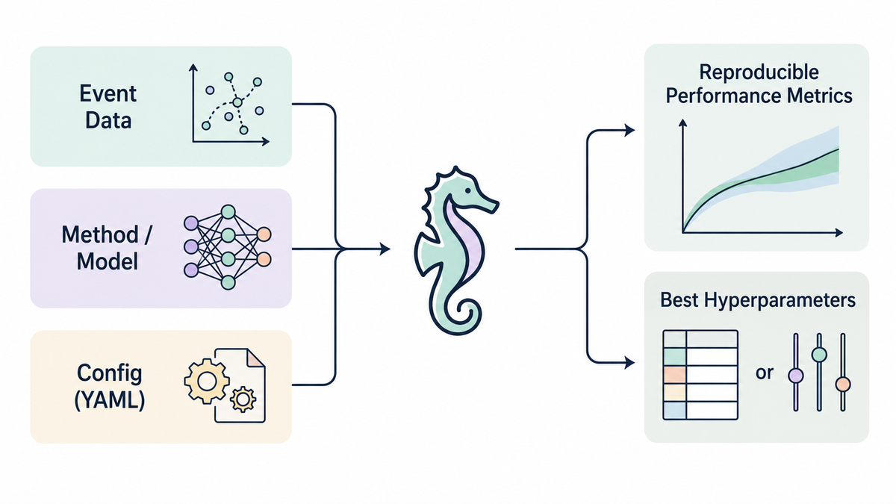

---
hide:
  - toc
---

# Seahorse

<p class="hero-tagline">
A modular, research-grade framework for end-to-end development, training, and evaluation of<br>
spatio-temporal point-process (STPP) models.
</p>

Seahorse couples declarative YAML configuration with PyTorch Lightning
execution, Ray Tune hyper-parameter optimisation, and version-controlled run
artifacts to support rapid prototyping and reproducible benchmarking on
streaming event data.

<div class="grid cards hero-cards" markdown>

-   :material-play-circle:{ .lg .middle } **Run One Model**

    ---

    Fit, evaluate, and sample from any registered model through a consistent
    Python API.

    [:octicons-arrow-right-24: Python API](python-api.md)

-   :material-chart-bar-stacked:{ .lg .middle } **Run a Benchmark**

    ---

    Compare presets across datasets and seeds from one CLI command with saved,
    reproducible artifacts.

    [:octicons-arrow-right-24: Run A Benchmark](examples/run-a-small-benchmark.md)

-   :material-magnify:{ .lg .middle } **Evaluate Results**

    ---

    Run metric profiles — likelihood, predictive, surface — on any saved run directory.

    [:octicons-arrow-right-24: Evaluation Guide](evaluation.md)

-   :material-plus-box-outline:{ .lg .middle } **Add Your Model**

    ---

    Register a preset and your model works with `fit`, `bench`, and the metric
    profiles without changing import paths.

    [:octicons-arrow-right-24: Developer Guide](adding-a-model.md)

</div>

## What Seahorse Provides

| Capability | What it gives you |
| --- | --- |
| **Unified Python API** | Train, evaluate, and sample any supported model through one interface. |
| **YAML-driven experiments** | Keep hyperparameters, data paths, and run settings explicit and reproducible. |
| **Model presets** | Switch among AutoSTPP, DeepSTPP, neural CNF families, diffusion models, NSMPP, SMASH, THP, RMTPP, and parametric baselines. |
| **Benchmark campaigns** | Run multi-preset, multi-dataset, multi-seed evaluations with comparable metrics. |
| **Artifact-backed evaluation** | Save run directories, metric tables, predictive samples, and surface diagnostics for later inspection. |

## Quick Start

=== "Python API"

    ```python
    from unified_stpp import AutoSTPP, PoissonGMM, load_jsonl

    train = load_jsonl("dataset_root/train.jsonl")
    val   = load_jsonl("dataset_root/val.jsonl")
    test  = load_jsonl("dataset_root/test.jsonl")

    model    = AutoSTPP(device="cpu")
    baseline = PoissonGMM()

    model.fit(train, val, test, epochs=50, batch_size=64)
    scores  = model.evaluate(test)
    samples = model.predict_next(test, n_samples=32)
    ```

=== "CLI"

    ```bash
    python -m unified_stpp fit \
      --preset auto_stpp \
      --train dataset_root/train.jsonl \
      --val   dataset_root/val.jsonl \
      --test  dataset_root/test.jsonl \
      --out   runs/quickstart
    ```

## Benchmarking Workflow

Seahorse reads JSONL event-sequence splits from local files or compatible
Hugging Face datasets. Every benchmark run applies a shared data contract so
models are evaluated on the same train, validation, and test splits with the
same metric definitions.

<div class="hero-figure">
  
</div>

Start with the [end-to-end case study](examples/case-study.md), run a
[small benchmark](examples/run-a-small-benchmark.md), or open the
[tutorial notebooks](examples/colabs.md).
